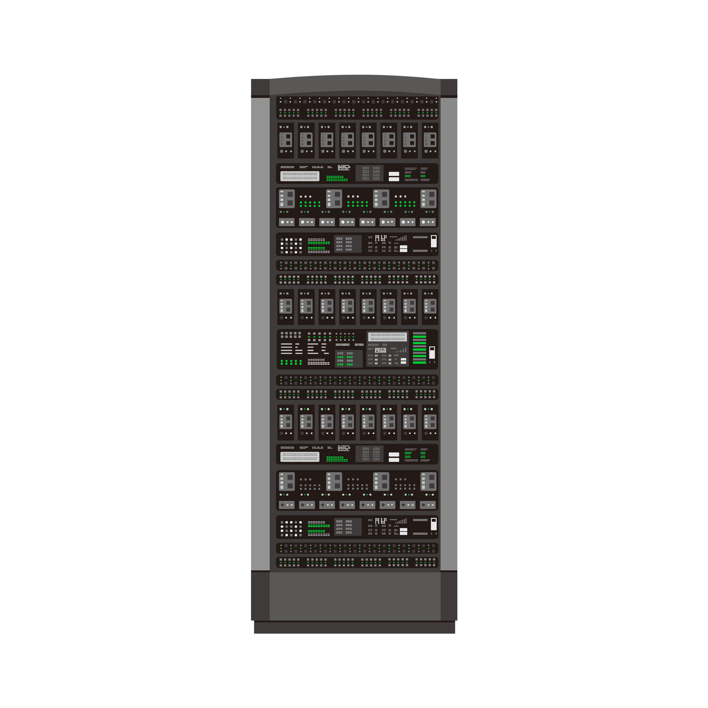
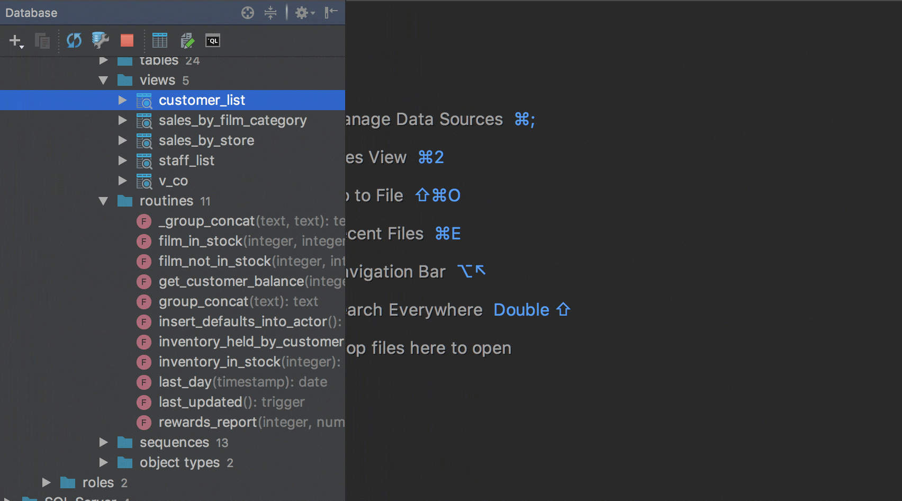

### <h2 align="center">Coé 👋</h2>

Chamo-me Yuri Cunha, tenho 24 anos, moro em S. B. Campo — SP, sou estudante de Banco de Dados e atualmente sou Database Administrador Jr. e Backend Jr.  
A maior parte do meu trabalho é feita nos finais de semana, no meu tempo livre, mas às vezes também trabalho durante a semana. Se eu não responder ao seu problema, geralmente é porque estou ocupado no momento ou estou aproveitando um pouco do meu tempo livre. Tentarei me manter atualizado em todos os lugares que puder, embora não responda imediatamente.  

### <h2 align="center">Curiosidades ✨</h2>

— Sou fã de Mr. Robot e The Big Bang Theory. 
— Gosto de ler livros e jogar futebol americano. 
— Até o momento sei cuidar de “prantas”. 
— Às vezes faço trocadilhos/piadas ruins. 
— Comida preferida: macarronada e carne moída.  

### <h2 align="center">Skills 📋</h2>

    

### <h2 align="center">Contatos 📧</h2>

 
 

<!--  --->
